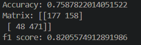
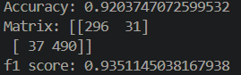
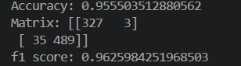

# Loan Approval Predictor

A machine learning project built in Python to predict whether a loan application will be approved. This project compares three different classification models: **Logistic Regression**, a **Decision Tree**, and a **Random Forest**.

---

## 📊 Features

- Preprocessed loan dataset (handled missing values, encoded categorical data).
- Trained and evaluated three distinct classification models.
- Evaluated using key classification metrics like the **Confusion Matrix**, **Accuracy**, and **F1-Score**.
- Includes a `requirements.txt` file for easy setup of the environment.

---

## 💻 Technologies Used

- Python
- Pandas & NumPy for data manipulation
- Matplotlib & Seaborn for data visualization
- Scikit-learn for modeling and evaluation

---

## 🚀 Getting Started

### 1. Clone this repository

```bash
git clone https://github.com/samwithwicky/loan-approval-predictor.git
cd loan-approval-predictor
```

### 2\. Set up a virtual environment

```bash
python -m venv venv
# On Windows
venv\Scripts\activate
# On macOS/Linux
source venv/bin/activate
```

### 3\. Install dependencies

```bash
pip install -r requirements.txt
```

### 4\. Run the models

You can run any of the three model scripts:

```bash
# To run the Logistic Regression model
python loan_logistic.py

# To run the Decision Tree model
python loan_tree.py

# To run the Random Forest model
python loan_forest.py
```

---

## 📁 Project Structure

```
loan-approval-predictor/
├── assets/
│   ├── forest.png
│   ├── logistic.png
│   └── tree.png
├── loan_approval_data.csv
├── loan_forest.py
├── loan_logistic.py
├── loan_tree.py
├── README.md
└── requirements.txt
```

---

## 📈 Model Evaluation Results

The performance of each model on the test dataset is visualized below:

### Logistic Regression



### Decision Tree



### Random Forest



While tree and forest have the largest accuracy scores this is actually due to overfitting and logistic regression actually provides the most reliable results.

## 📂 Dataset Source

The dataset used is: [Loan Prediction Kaggle Dataset](https://www.kaggle.com/datasets/architsharma01/loan-approval-prediction-dataset)

---

## 🔭 Next Steps

- **Feature Engineering:** Create new, more informative features from the existing data.
- **Hyperparameter Tuning:** Use techniques like GridSearchCV to find the optimal parameters for each model.
- **Ensemble Methods:** Combine the models using a Voting Classifier to potentially improve prediction accuracy.
